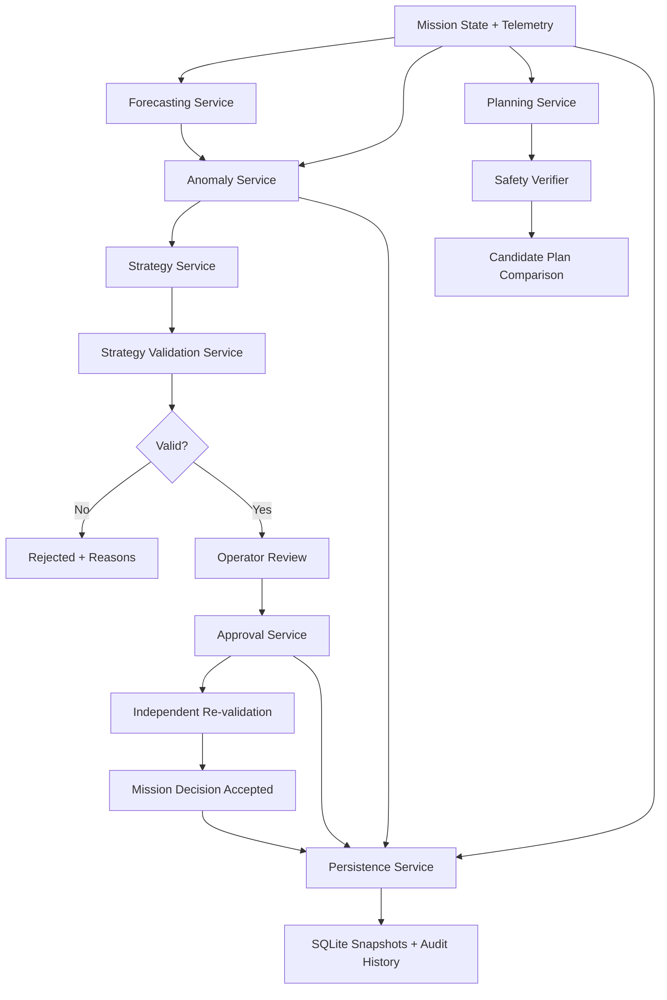

<div align="center">


# LunaYield Mission Lab

### Forecast risk. Detect anomalies. Validate recovery strategies. Keep the operator in control.

**IBM Space Exploration Hackathon — Lunar rover operations and mission-planning platform**

[Live Demo](https://lunayield.onrender.com) · [Mission Control](https://lunayield.onrender.com/mission-control) · [Problem & Solution](https://lunayield.onrender.com/problem-solution) · [Tech & Demo](https://lunayield.onrender.com/tech)

</div>

---

## Mission

A lunar rover operates under hard constraints: limited battery, storage, communication windows, operating time, thermal conditions, and competing science objectives.

A mission-planning system should not wait for a resource failure before reacting.

**LunaYield is a human-in-the-loop mission decision-support platform that forecasts resource risk, detects current and predicted anomalies, generates deterministic response strategies, validates them against explicit rules, and requires operator approval before mission decisions advance.**

The core design principle is simple:

> **Decision assistance can recommend. Deterministic validation and the human operator remain authoritative.**

---

## Judge Quick Access

| What to review | Where |
|---|---|
| **Live presentation site** | https://lunayield.onrender.com |
| **Problem & Solution** | https://lunayield.onrender.com/problem-solution |
| **Mission Control** | https://lunayield.onrender.com/mission-control |
| **Tech, Architecture & Demo** | https://lunayield.onrender.com/tech |
| **Full demo walkthrough** | [`docs/demo-walkthrough.md`](docs/demo-walkthrough.md) |
| **IBM Bob development evidence** | [`docs/bob-development-log.md`](docs/bob-development-log.md) |
| **Submission wording** | [`docs/submission-wording.md`](docs/submission-wording.md) |
| **Agent architecture & constraints** | [`AGENTS.md`](AGENTS.md) |

### Validation at a Glance

**506 automated tests**

- **318 backend tests** — Pytest
- **183 frontend tests** — Vitest
- **5 end-to-end tests** — Playwright
- Ruff linting and formatting checks
- Frontend production build and lint validation
- Deterministic, repeatable demo state

> The free Render instance may spin down after inactivity, so the first request can take additional time while the service wakes.

---

## The Problem

Lunar surface missions have to balance scientific return against finite operational resources.

A rover may have enough battery to reach another science target but not enough to return safely. Storage may fill before the next communication opportunity. Thermal conditions can become risky. Communication windows can shrink. A locally attractive decision can therefore create a mission-level failure several steps later.

Traditional dashboards primarily show **what is happening now**.

LunaYield focuses on the next questions an operator needs answered:

1. **What is likely to happen next?**
2. **Which resources are moving toward unsafe or degraded conditions?**
3. **What response strategies are available?**
4. **Which options are actually valid?**
5. **What should the operator approve — and why?**

---

## The LunaYield Workflow

```text
Live Mission State
        │
        ▼
Resource Forecasting
        │
        ▼
Current + Predicted Anomaly Detection
        │
        ▼
Candidate Strategy Generation
        │
        ▼
Deterministic Validation
        │
        ▼
Operator Review & Approval
        │
        ▼
Mission State Transition
        │
        ▼
Persistence + Immutable Audit History
```

LunaYield separates **prediction, recommendation, validation, and authority** instead of collapsing them into a single opaque decision.

### 1. Observe

Mission state and telemetry track:

- Battery
- Storage
- Temperature
- Communication availability
- Remaining operating time
- Mission lifecycle state
- Active route

Live telemetry is streamed to the frontend through WebSockets.

### 2. Forecast

The backend deterministically projects resource behavior over a configurable horizon from **10 minutes to 8 hours**.

Forecasting is intentionally deterministic and reproducible so the same mission state produces the same projected behavior.

### 3. Detect

LunaYield evaluates both the current mission state and forecasted resource states.

Anomalies are classified by:

- Resource
- Type
- Severity
- Current-state or forecast provenance
- Predicted time-ahead when applicable

Supported anomaly categories include:

- `resource_depletion`
- `thermal`
- `comm`
- `performance`

Severity levels are:

- `info`
- `warning`
- `critical`

### 4. Generate Strategies

Detected anomalies are mapped into structured candidate strategies such as:

- Conserve
- Monitor
- Offload
- Schedule
- Thermal response
- Communications response
- Expedite
- Optimize

Each strategy includes structured identifiers, title, rationale, priority, recommended actions, affected resources, and source anomalies.

### 5. Validate

Strategies are not trusted merely because they were generated.

The backend performs deterministic validation covering:

- Schema validity
- Required fields
- Priority bounds
- Action whitelist
- Resource consistency
- Approval requirements

Invalid strategies are rejected with structured reasons.

### 6. Require Human Approval

A strategy must be explicitly approved by the operator.

Approval triggers **independent re-validation** before the decision is accepted.

The frontend follows a fail-closed model:

- Missing validation → no approval
- Loading validation → no approval
- Unavailable validation → no approval
- Incomplete validation → no approval
- Explicit backend `is_valid=true` → approval can become available

Approval records operator intent; it does not silently mutate mission resources.

---

## Why LunaYield Is Different

### Deterministic Safety Boundaries

LunaYield does not delegate mission safety to a probabilistic model.

The deployed backend uses deterministic logic for:

- Mission state transitions
- Telemetry evolution
- Resource forecasting
- Anomaly detection
- Candidate plan generation
- Strategy generation
- Strategy validation
- Plan safety verification
- Approval gating

There is **no LLM or ML model in the deployed mission backend**.

This is intentional.

For a safety-oriented mission workflow, explainability, repeatability, traceability, and explicit authority boundaries matter more than allowing a generative model to directly control mission state.

### Backend-Authoritative Architecture

The backend owns:

- Mission state
- Plan validity
- Strategy validity
- Safety verification
- Approval transitions
- Persistence
- Audit history

The frontend **never calculates safety**. It renders backend decisions and blocks unsafe actions when authoritative validation is absent.

### Human-in-the-Loop Control

LunaYield is designed as decision support rather than autonomous execution.

The system can forecast, detect, recommend, and validate.

**The operator retains the final approval decision.**

### Explainable Rejection

Rejected plans and invalid strategies remain visible for auditability.

They show why they failed, but they are:

- Never recommended
- Never given an active approval path
- Never treated as executable

---

## Demo Scenario

### Shackleton Rim Survey — Alpha

Mission ID: `luna-mission-001`

The seeded mission follows five waypoints:

```text
Base Camp
   ↓
Crater A Rim
   ↓
Ice Deposit Site
   ↓
Ridge Observation Point
   ↓
Base Camp (Return)
```

Initial resources:

| Resource | Seed State |
|---|---:|
| Battery | 100% |
| Storage | 0% |
| Temperature | -40°C |
| Communication window | 2 hours |
| Operating time | 8 hours |

### Deterministic Candidate Plans

| Plan | Predicted Return Battery | Science Yield | Result |
|---|---:|---:|---|
| **Minimal Survey** | 34% | 45 | VALID |
| **Extended Survey** | 42% | 78 | **VALID + RECOMMENDED** |
| **Aggressive Survey** | 11% | 92 | **REJECTED** |

The Aggressive Survey offers the highest science yield, but it violates the mission's deterministic return-battery safety requirement.

### Safety Rule

```text
RETURN_BATTERY_MIN_20PCT
Predicted return battery must be >= 20%
```

This demonstrates the central LunaYield tradeoff:

> **The highest-yield option is not automatically the best mission decision.**

The system preserves the unsafe option for explainability while preventing it from being recommended or approved.

---

## End-to-End Mission Experience

A typical LunaYield demo progresses through:

```text
IDLE
  ↓
RUNNING
  ↓
ANOMALY
  ↓
PLANNING
  ↓
AWAITING_APPROVAL
  ↓
EXECUTING
```

During the workflow, the operator can observe live mission state, trigger the deterministic demo anomaly, compare candidate plans, inspect safety results, select the recommended valid plan, approve it, and see the mission route and audit history update.

Phases 3–5 extend this workflow with forecast-aware anomaly detection, strategy generation, validation, and operator approval.

For the complete operator sequence, see:

**[`docs/demo-walkthrough.md`](docs/demo-walkthrough.md)**

---

## System Architecture



### Deployment Architecture

LunaYield is deployed as a **single Dockerized Render Web Service**.

```text
Render Web Service
│
├── FastAPI Backend
│   ├── REST API under /api
│   ├── WebSocket at /api/ws/mission
│   ├── Domain + safety services
│   └── SQLite runtime persistence
│
└── React / Vite Production Build
    └── Served by FastAPI with SPA route fallback
```

This deployment keeps the presentation site, Mission Control frontend, REST API, WebSocket telemetry, and backend state model in one deployable service.

---

## Backend Services

| Service | Responsibility |
|---|---|
| **MissionService** | Authoritative mission state and lifecycle transitions |
| **PlanningService** | Deterministic three-plan candidate generation |
| **SafetyVerifier** | Pure-Python candidate-plan safety verification |
| **TelemetryService** | Deterministic tick-based telemetry |
| **ForecastingService** | Deterministic resource forecasting |
| **AnomalyService** | Current and forecast-derived anomaly detection |
| **StrategyService** | Deterministic anomaly-to-strategy mapping |
| **ValidationService** | Strategy schema and structure validation |
| **ApprovalService** | Explicit approval with mandatory re-validation |
| **PersistenceService** | Mission runs, snapshots, restoration, audit history |
| **WSConnectionManager** | Live telemetry broadcast to connected clients |

### API Surface

Primary routes include:

```text
/api/mission
/api/plans
/api/forecast
/api/anomalies
/api/strategies
/api/strategies/validate
/api/strategies/{strategy_id}/approve
/api/history
/api/ws/mission
```

---

## Frontend Experience

The React frontend combines the hackathon presentation experience with the operational Mission Control interface.

### Presentation Routes

| Route | Purpose |
|---|---|
| `/` | LunaYield overview and project introduction |
| `/problem-solution` | Problem framing and solution |
| `/mission-control` | Interactive operational Mission Control |
| `/tech` | Tech stack, architecture, and demo information |

### Mission Control Components

- **MissionControls** — state-aware operator actions
- **PlanComparison** — candidate plans with validity and safety visibility
- **ForecastPanel** — resource projections with configurable horizon
- **AnomalyPanel** — severity, resource, type, and forecast provenance
- **StrategyPanel** — priorities, actions, validation, and approval
- **TelemetryPanel** — live WebSocket telemetry
- **RoutePanel** — active mission route
- **ResourcePanel** — current resource state
- **AuditPanel** — newest-first immutable event history
- **useMissionSocket** — WebSocket reconnection/backoff handling
- **useMission hooks** — TanStack Query API integration

---

## Persistence & Recovery

LunaYield uses SQLite with SQLModel to preserve mission history.

Implemented persistence behavior includes:

- Mission run creation
- Run snapshots at mission milestones
- Immutable audit history
- Run completion and archival
- Paginated history APIs
- Graceful-shutdown final snapshot
- Startup restoration from the latest snapshot
- Automatic SQLModel metadata initialization

The database path is derived from the backend package rather than the shell's current working directory, allowing predictable local execution.

---

## Validation & Testing

LunaYield was built around repeatability and regression protection.

### Automated Test Suite

| Layer | Tool | Tests |
|---|---|---:|
| Backend | Pytest | **318** |
| Frontend | Vitest | **183** |
| End-to-End | Playwright | **5** |
| **Total** |  | **506** |

The suite covers areas including:

- Mission lifecycle transitions
- Candidate-plan generation
- Safety verification
- Invalid-plan rejection
- Approval behavior
- WebSocket state
- Persistence and restoration
- Forecasting
- Anomaly provenance
- Strategy generation
- Strategy validation
- Fail-closed frontend behavior
- Integrated mission workflows

### Quality Checks

Backend:

```powershell
cd backend
.\.venv\Scripts\Activate.ps1

python -m ruff check app tests
python -m ruff format --check app tests
python -m pytest -v
```

Frontend:

```powershell
cd frontend

npm run build
npm run lint
npm run test
```

End-to-end tests, with backend and frontend running:

```powershell
cd frontend
npx playwright test
```

---

## Tech Stack

### Backend

- Python 3.12
- FastAPI
- Pydantic
- SQLModel
- SQLite
- FastAPI WebSockets
- Pytest
- Ruff

### Frontend

- React 18
- TypeScript
- Vite
- Tailwind CSS
- TanStack Query
- Zustand
- Vitest
- Playwright

### Deployment

- Docker
- Render

### AI-Assisted Development

- IBM Bob — primary AI-assisted development environment and project-development tool

### Runtime AI / ML

**None in the deployed backend.**

Forecasting, anomaly detection, strategy generation, validation, and safety decisions are deterministic.

---

## Quick Start

### Prerequisites

- Python 3.12+
- Node.js 20+
- npm

### 1. Clone the Repository

```powershell
git clone https://github.com/unity-darshthakkar/LunaYield.git
cd LunaYield
```

### 2. Start the Backend

```powershell
cd backend

python -m venv .venv
.\.venv\Scripts\Activate.ps1

pip install -e ".[dev]"

python -m uvicorn app.main:app --host 127.0.0.1 --port 8000
```

Backend health check:

```text
http://127.0.0.1:8000/health
```

### 3. Start the Frontend

Open a second terminal:

```powershell
cd frontend

npm install
npm run dev -- --host 127.0.0.1
```

Open:

```text
http://127.0.0.1:5173
```

The Vite development server proxies `/api` requests to the backend on port `8000` and upgrades the WebSocket connection.

### 4. Run the Demo

Follow:

**[`docs/demo-walkthrough.md`](docs/demo-walkthrough.md)**

---

## Detailed Implementation Status

LunaYield was developed in deliberate phases, with each phase extending the previous system without weakening its safety boundaries.

### Phase 1 — Vertical MVP

- ✅ Deterministic mission lifecycle
- ✅ Live WebSocket telemetry
- ✅ Deterministic anomaly injection
- ✅ Three deterministic candidate plans
- ✅ `RETURN_BATTERY_MIN_20PCT` safety verification
- ✅ Rejected plans visible but non-actionable
- ✅ Exactly one valid recommended plan in the seeded scenario
- ✅ Explicit human approval
- ✅ Route update after approval
- ✅ Immutable audit trail
- ✅ Deterministic reset for repeatable demos
- ✅ FastAPI authoritative backend
- ✅ React/TypeScript operator frontend

### Phase 2 — Persistence & Recovery

- ✅ SQLite persistence with SQLModel
- ✅ Mission run lifecycle
- ✅ Full-state snapshots
- ✅ Persisted immutable audit history
- ✅ Paginated history
- ✅ Graceful-shutdown snapshot
- ✅ Startup restoration
- ✅ Automatic database metadata initialization

### Phase 3 — Forecasting & Anomaly Detection

- ✅ Deterministic forecasting across mission resources
- ✅ Configurable forecast horizon from 10 minutes to 8 hours
- ✅ Validated forecast intervals
- ✅ Current-state and forecast-derived anomaly detection
- ✅ Resource/type/severity classification
- ✅ Forecast provenance
- ✅ Predicted time-ahead
- ✅ Shared forecast horizon across dependent UI
- ✅ No probabilistic model dependency

### Phase 4 — Strategy Generation, Validation & Approval

- ✅ Deterministic anomaly-to-strategy mapping
- ✅ Multiple structured candidate strategies
- ✅ Priority ordering and deduplication
- ✅ Pydantic response/schema validation
- ✅ Required-field checks
- ✅ Priority-bound checks
- ✅ Action-whitelist validation
- ✅ Resource-consistency validation
- ✅ Structured rejection reasons
- ✅ Optional forecast-aware generation
- ✅ Explicit strategy approval endpoint
- ✅ Mandatory approval-time re-validation
- ✅ Approval separated from resource mutation

### Phase 5 — Operator UX & Integration

- ✅ Shared forecast horizon selector
- ✅ Forecast visualization
- ✅ Anomaly severity and provenance UI
- ✅ NOMINAL-state handling
- ✅ Independent panel failure behavior
- ✅ Priority-sorted strategy cards
- ✅ Strategy rationale and actions
- ✅ Source anomaly visibility
- ✅ Explicit validation states
- ✅ Invalid-strategy rejection reasons
- ✅ Fail-closed approval UI
- ✅ Terminal approval-state handling
- ✅ No direct strategy-execution controls
- ✅ Integration regression coverage

### Phase 6 — Final Demo & Submission Polish

- ✅ Backend validation
- ✅ Frontend validation
- ✅ End-to-end demo validation
- ✅ Documentation cleanup
- ✅ Setup/run instruction verification
- ✅ Judge/demo walkthrough
- ✅ IBM Bob development evidence organization
- ✅ Submission wording
- ✅ Dockerized deployment
- ✅ Presentation-site polish

---

## Safety Architecture

LunaYield treats safety as a system property rather than a UI convention.

### Authority Rules

1. **Backend mission state is authoritative.**
2. **Frontend code never determines whether a plan is safe.**
3. **Rejected plans remain visible but cannot be approved.**
4. **Invalid strategies remain visible with structured failure reasons.**
5. **Strategy approval requires an explicit backend-valid state.**
6. **Approval independently re-runs validation.**
7. **No LLM can directly mutate mission state.**
8. **Safety verification remains separate from any future model reasoning.**

### Candidate-Plan Safety

The Phase 1 candidate-plan verifier enforces:

```text
RETURN_BATTERY_MIN_20PCT
```

A candidate plan must predict at least **20% battery remaining on return**.

### Strategy Validation

Phase 4 strategy validation checks structural and semantic consistency:

- Required fields
- Schema correctness
- Priority bounds
- Permitted actions
- Resource consistency
- Approval requirement

These checks are intentionally distinct from the Phase 1 return-battery safety threshold.

---

## IBM Bob Development Workflow

**IBM Bob served as LunaYield's primary AI-assisted development environment and project-development tool.**

Bob was used to establish and guide:

- Repository architecture
- Engineering rules
- Safety constraints
- Development plan
- Phase structure
- Agent guidance
- Validation discipline
- Documentation and submission workflow

Additional AI-assisted tooling was used during implementation and testing, while development remained guided by the architecture and safety constraints established through the Bob workflow.

### Bob Evidence

| Evidence | Location |
|---|---|
| Bob project artifacts | [`.bob/`](.bob/) |
| Agent rules and engineering constraints | [`AGENTS.md`](AGENTS.md) |
| Development provenance | [`docs/bob-development-log.md`](docs/bob-development-log.md) |
| Phase-based implementation history | Git commit history |

The project documentation intentionally distinguishes between **AI-assisted software development** and the **runtime mission system**. IBM Bob supported development; the deployed mission-decision backend itself remains deterministic.

---

## Development Phases

| Phase | Focus |
|---|---|
| **0** | Project Foundation — architecture, safety rules, engineering constraints, agent guidance, development plan |
| **1** | Vertical MVP — mission lifecycle, telemetry, anomaly, plans, safety, approval, UI |
| **2** | Persistence & Recovery — SQLite, snapshots, audit, restoration, history |
| **3** | Forecasting & Anomaly Detection — deterministic projection, anomaly detection, provenance |
| **4** | Strategy Generation, Validation & Approval — anomaly-to-strategy mapping, validation, approval |
| **5** | Operator UX & Integration — forecast/anomaly/strategy UI and fail-closed approval |
| **6** | Final Demo & Submission Polish — validation, documentation, deployment, presentation and demo readiness |

---

## Repository Structure

```text
LunaYield/
├── .bob/           # IBM Bob project artifacts
├── backend/        # FastAPI backend, domain services, safety and persistence
├── frontend/       # React/Vite presentation site and Mission Control
├── docs/           # Demo, architecture, submission and Bob evidence
├── datasets/       # Small project/demo data assets
├── Dockerfile      # Production deployment
├── AGENTS.md       # Agent guidance and engineering constraints
├── logo.png        # LunaYield project logo
└── README.md
```

---

## Documentation

- [`docs/demo-walkthrough.md`](docs/demo-walkthrough.md) — full operator demo walkthrough
- [`docs/phase-1-demo-walkthrough.md`](docs/phase-1-demo-walkthrough.md) — legacy Phase 1 walkthrough
- [`docs/bob-development-log.md`](docs/bob-development-log.md) — IBM Bob development provenance
- [`docs/submission-wording.md`](docs/submission-wording.md) — judge-facing submission wording
- [`AGENTS.md`](AGENTS.md) — engineering constraints and agent guidance

---

## Design Principles

LunaYield was built around five principles:

**1. Forecast before failure.**  
Use current mission state to expose future resource risk rather than only current telemetry.

**2. Determinism where safety matters.**  
Mission-critical validation should be reproducible and explainable.

**3. Separate recommendation from authority.**  
Generation does not imply validity, and validity does not imply operator approval.

**4. Fail closed.**  
When authoritative validation is missing or unavailable, LunaYield does not expose approval controls.

**5. Preserve evidence.**  
Snapshots, audit events, validation states, rejected alternatives, and development provenance remain inspectable.

---

## Current Scope & Limitations

LunaYield is a hackathon prototype and mission-decision-support demonstration, not flight-certified software.

Current scope intentionally uses:

- Seeded mission data
- Deterministic telemetry and forecasts
- Deterministic anomaly-to-strategy mappings
- A focused candidate-plan safety rule
- SQLite persistence
- A simulated lunar rover workflow

It does **not** claim to provide:

- Flight-certified autonomous control
- Physics-grade lunar rover simulation
- Real spacecraft telemetry integration
- Autonomous execution without operator approval
- ML-based forecasting in the deployed backend

These boundaries keep the demo reproducible and make every safety-relevant decision inspectable.

---

## Project Status

**Phases 0–6 complete.**

LunaYield is demo-ready with:

- Deployed presentation site
- Interactive Mission Control
- REST API
- WebSocket telemetry
- Forecasting and anomaly detection
- Strategy generation and validation
- Human approval workflow
- Persistence and restoration
- Auditability
- Docker deployment
- **506 automated tests**

---

## License

IBM Space Exploration Hackathon project.